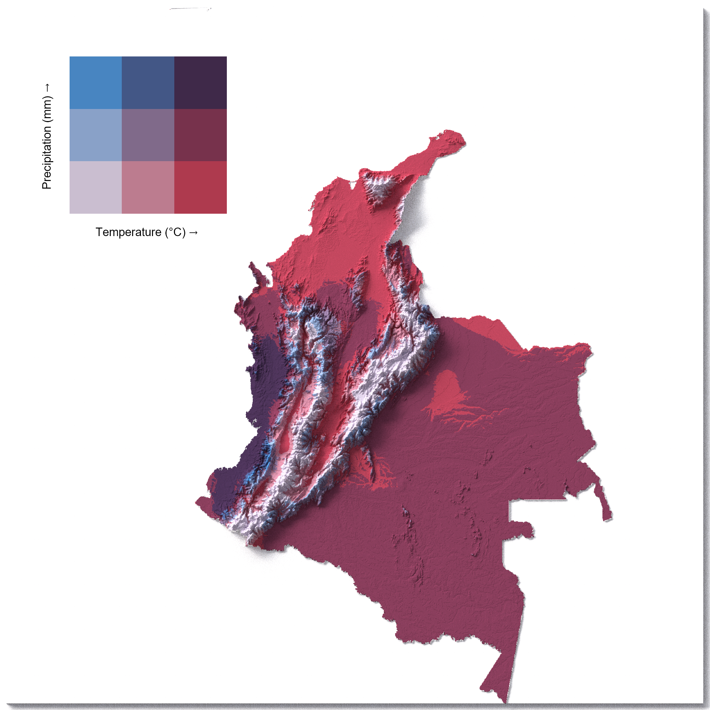

# 🌎 Bivariate Climate–Elevation 3D Map of Colombia

This repository contains an R workflow to create a **3D bivariate map of Colombia**, combining:  
- **CHELSA bioclimatic data** (BIO1: Annual Mean Temperature, BIO12: Annual Precipitation)  
- **Digital Elevation Model (DEM)** from the `elevatr` package  
- **Bivariate classification** using the `biscale` package  
- **3D rendering** with `rayshader`  

The result is a high-quality map where **temperature and precipitation** are represented in color, while **topography** is represented in relief.

---


## 🔧 Requirements

This project was built in **R (≥ 4.2)** with the following packages:

```r
pacman::p_load(
  geodata, tidyverse, sf, terra,
  rchelsa, biscale, elevatr, rayshader,
  magick
)
📥 Data Sources
CHELSA Bioclimatic Variables
CHELSA V2.1 — BIO1 (Annual Mean Temperature) and BIO12 (Annual Precipitation)

Administrative boundaries
GADM

Digital Elevation Model
Retrieved from elevatr

HDRI Lighting
PolyHaven HDRIs

▶️ Usage
Clone this repository:

bash
Copiar código
git clone https://github.com/yourusername/colombia-bivariate-3d.git
cd colombia-bivariate-3d
Run the script in R:

r
Copiar código
source("script.R")
The output will be saved in outputs/:

colombia-bivariate-3d.png – high-quality 3D render

legend.png – bivariate legend

colombia-bivariate-3d-legend.png – final map with legend overlay

📊 Output Example
Here is the final rendered map:


🙏 Acknowledgments
This workflow is based on the repository
milos-agathon/3d-bivariate-climate-maps,
with several modifications and adjustments, including:

Adaptation to Colombia using GADM boundaries

Integration of CHELSA V2.1 climate data (BIO1 and BIO12)

Improved CRS handling and raster alignment with terra

Automated download and error handling for CHELSA data

Custom overlay of bivariate legend using magick

📄 License
This repository is released under the MIT License.
Please cite CHELSA and GADM when using the data.
